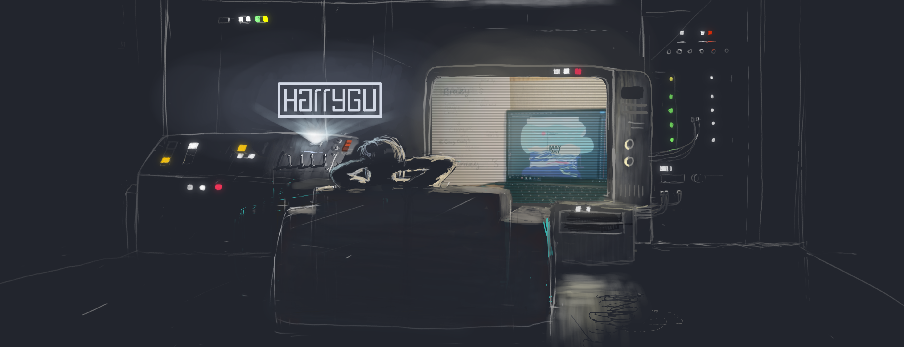

# Harry Gu

Web Design | UX Research | A11y | Front-End Dev

I'm Harry Gu. I research, design, and code. I start by watching people doing things, then build solutions where accessibility is the default. I treat design like science: form a hypothesis, ship it, measure whether it actually worked. I prefer pragmatic simplicity. If two solutions achieve the same outcome, I choose the one that's easier to maintain, document, and scale. Graphic Design at Calvin University, UX & Dev at University of Michigan - Ann Arbor. Fluent in English and Mandarin.

## My Accessibility Journey
- My early projects (Kosmos, Exodus Place) prioritized the accessibility barriers my users faced most directly: color contrast, cognitive load, motor accessibility, and clear visual hierarchy.
- At University of Michigan, I've since formalized my technical implementation skills—semantic HTML, ARIA labels, keyboard navigation, skip links, and auditing with WAVE/Axe. 

## Product Impacts
*   **Reduced 80% Dev Scope:** For *Kosmos Resort*, I proposed and engineered an [open-source calendar widget](https://github.com/kosmosharry/mews-availability.js) to replace a full system rebuild.
*   **-10% Bounce Rate:** Redesigned the *Kosmos* web experience, reducing bounce rate by 10% (serving **6,800+ monthly visitors**).
*   **React Native Design Sytems:** Built [ReentryGuide GR](https://harrygu.art/reentryguide-gr.html) (React Native/Expo). Deployed to community pilot group to aid formerly incarcerated individuals in accessing essential resources. 

## What I Do & Study
- **Human-Computer Interaction**: Designing for cognitive load, motor accessibility, and attention under stress
- **Research & Design**: Qualitative Research, Design Thinking (Divergence/Convergence), Affinity Mapping, Personas, QOC Rationale
- **Inclusive Design**: Accessibility Audits (WAVE/Axe, Keyboard Navigation/Tabbing)
- **Community-Embedded Research**: Experience from within + Usability testing
- **Front-End Development**: React Native, HTML/CSS/JS
- **End-to-End Delivery**: Research → Figma → React Native → Shipped

## Current
MS in Information @ University of Michigan School of Information

## Links
- [Portfolio](https://harrygu.art)
- [LinkedIn](https://linkedin.com/in/harrygu-ux)
